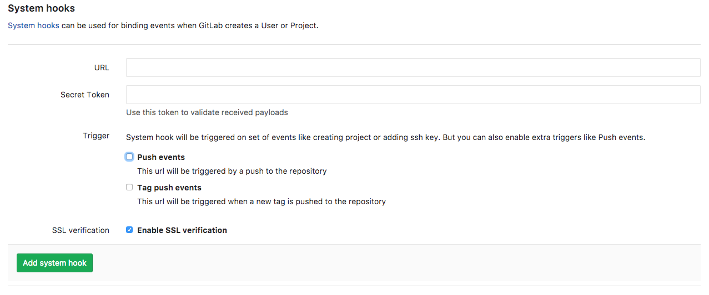
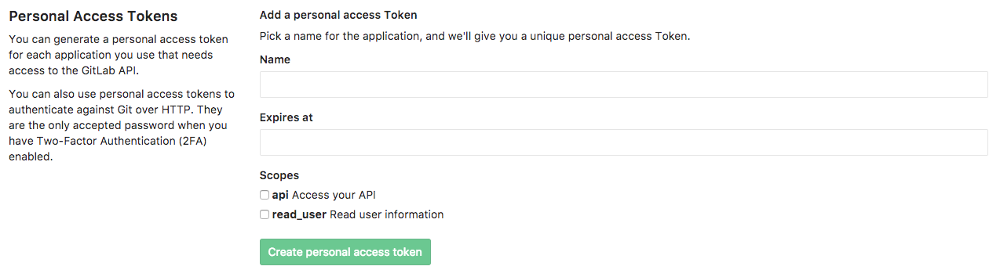
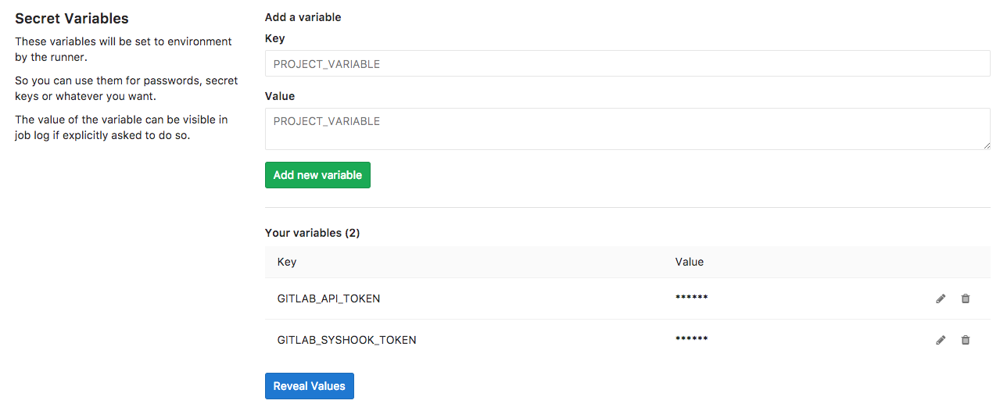

# GitLab Boilerplate Injector

## Why???

Read the blog post [here](https://www.trek10.com/blog/making-ci-easier-with-gitlab/) to get the background.

## What it does

This is a tool to help you make the initial commit in new GitLab repos. This allows you to inject helpful files,
such as CI configuration, README, and `.gitignore`. It is configurable so you can have different groups/subgroups
get different files injected into them.

## Configuring and deploying the injector

Here are the tasks you should do to deploy the injector:
1) Repo setup
2) Edit the injectables
3) Edit the group injection configs
4) Setup GitLab API tokens
5) Configure Serverless and GitLab CI
6) Configure AWS IAM
7) Push and deploy

### Repo setup

Make a new repo in your GitLab instance to hold your copy of this injector and clone it to your
system. Download a copy of this repo and put it in the local clone of your repo. **DO NOT push yet!**
Because we use GitLab CI to deploy the injector, pushing now will attempt to trigger a deployment
that will fail miserably. Hold off until the last step. If you must push, branch first to something
other than `master`, as dev CI is currently disabled by default.

### Edit the injectables

The actual files that get injected into the new repos are stored in the `injectables` folder. We have
included some starter files that apply if you are using Node.js and Serverless. Feel free to change
them to meet your needs.

### Edit the group injection configs

What gets injected can be configured using regex. Let's say you have one group for Node.js projects
and another for Python projects. New repos in each group can get appropriate files injected. The
`group-injection-configs.js` file contains an array of these configurations. Each configuration
is an object with a RegExp literal used to match the path and an array of paths that map local files
to their destination in the new repo. See the default example below:

```
  {
    regex: /.*/,
    paths: [
      { source: 'injectables/.gitignore', target: '.gitignore' },
      { source: 'injectables/.gitlab-ci.yml', target: '.gitlab-ci.yml' },
      { source: 'injectables/README.md', target: 'README.md' }
    ]
  }
```

It is worth noting that you could even use this with an empty paths array to disable the injector
for certain projects or groups.

### GitLab API Tokens

You're going to need 2 different tokens for this to work. One is a system hook token (to validate that
the request came from your GitLab instance) and the other is a personal access token for the GitLab API.
Once we have these, we will add them to the repo where you will keep your copy of the injector.

#### Getting the System Hook Token

Go to `/admin/hooks` on your GitLab instance. You should see something like this:



Now, the only problem is that we don't have the URL yet. That's ok. Just create a complex and secure
Secret Token value and make a note of it for later.
It is also important to note that you do not need any extra triggers checked.
We will have to circle back and finish this at the end.

#### Getting the Personal Access Token

Go to `profile/personal_access_tokens` on your GitLab instance. You should see something like this:



To create one, give it a name, leave the `Expires at` blank (never expires), and check the `api`
box under `Scopes`. Then click the `Create personal access token` button. After the page load,
you will have a new token at the top of the page. Copy this and put it with your chosen
System Hook Token from the last section.

*Note: You may want to do this step with a unique account that doesn't belong to an actual user.
This prevents problems if the token holder's user leaves your org and their account has to be
deleted.*

#### Storing the tokens securely

Go to `<some group>/<your copy of the injector>/settings/ci_cd` on your GitLab instance. Scroll to
the `Secret Variables` section. You should see something like this:



Add the Personal Access Token with a key of `GITLAB_API_TOKEN`. Then add your chosen System Hook
Token with a key of `GITLAB_SYSHOOK_TOKEN`. These variables will be securely passed into the CI
process as environment variables, which will be picked up by Serverless and attached to the
deployed Lambda function.

### Configure Serverless and GitLab CI

We use [Serverless Framework](https://serverless.com/) and GitLab CI for the deployment process.
You'll find some `todo!!!`s in the `serverless.yml` and `.gitlab-ci.yml` (see below).
If you don't fill those it, you're going to have a bad time.
If you have any access restrictions (such as an IP filter) on your GitLab instance, you may need to deploy
the injector into the same account and VPC as the GitLab instance. Just uncomment the `vpc` section of
the `serverless.yml` and fill it in. The `GITLAB_INSTANCE_ADDRESS` can be an IP or domain name. If
you are using the VPC functionality, you'll want to use the private IP of the instance here.

##### `serverless.yml`

```
#  vpc: # uncomment and fill in as needed
#    securityGroupIds:
#      - # todo!!!
#    subnetIds:
#      - # todo!!!
  environment:
    GITLAB_API_TOKEN: ${env:GITLAB_API_TOKEN}
    GITLAB_SYSHOOK_TOKEN: ${env:GITLAB_SYSHOOK_TOKEN}
    GITLAB_INSTANCE_ADDRESS: # todo!!!
```

##### `.gitlab-ci.yml`

```
variables:
    PROD_ACCOUNT: "AWS Account Number Here!!!" # todo!!!
    STAGING_ACCOUNT: "AWS Account Number Here!!!" # todo!!!
    DEV_ACCOUNT: "AWS Account Number Here!!!" # todo!!!

image: trek10/ci:3.4 # todo: swap in your CI docker image as needed
```

### Configure AWS IAM

If you are working in an account or region that has not been used with GitLab CI, you must do some IAM work
to get things going. There are 2 parts to doing this in a secure manner:
1. Create/update an EC2 role in the account hosting the GitLab CI runner instance.
2. Create a cross-account access role in the account hosting the deployed services.

#### The GitLab CI runner EC2 role

If the `gitlab-ci-role` EC2 role below does not exist in the account hosting the GitLab CI runner instance, create
one and attach an inline policy like the one below.

##### gitlab-ci-role inline policy
```
{
    "Version": "2012-10-17",
    "Statement": [
        {
            "Effect": "Allow",
            "Action": "sts:AssumeRole",
            "Resource": [
                "arn:aws:iam::*:role/*ci-deployment"
            ]
        }
    ]
}
```

Retrieve the Role ID of this EC2 role with the following CLI command:

```
aws iam get-role --role-name gitlab-ci-role --query Role.RoleId --output text
```

#### The deployment cross-account trust role

Finally, create a `gitlab-ci-deployment` (or some other name ending in `ci-deployment`)
cross account access role in the account hosting that will
host the deployed services. This role should have the `AdministratorAccess` managed policy. In addition,
it needs to have the trust relationship policy below. Be sure to fill in the GitLab CI host account
number, the EC2 Role ID from the last step, and the GitLab CI runner's EC2 Instance ID (found in EC2
console).

##### gitlab-ci-deployment trust relationship policy document
```
{
  "Version": "2012-10-17",
  "Statement": [
    {
      "Effect": "Allow",
      "Principal": {
        "AWS": "arn:aws:iam::<GitLabCIHostAcctNumber>:root"
      },
      "Action": "sts:AssumeRole",
      "Condition": {
        "StringEquals": {
          "aws:userid": "<RoleId>:<EC2InstanceId>"
        }
      }
    }
  ]
}
```

### Push and deploy

If you have done everything correctly, you should be able to deploy the staging version by
pushing/merging everything to `master` in your GitLab repo. If that succeeds, create a tag in
GitLab to run the production deployment. View the log output from that deployment to get
the API Gateway URL. It should look something like this:
`https://someuniquevaluehere.execute-api.us-east-1.amazonaws.com/prod/inject`. Copy this
URL and circle back to the System Hook interface. Now you can add a system hook with
this URL and the Secret Token value that you created earlier.

# Congrats! You're all done!
